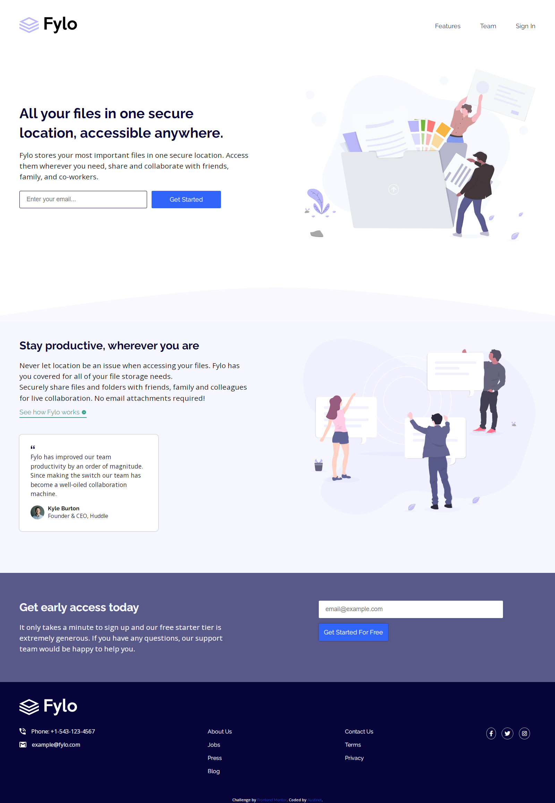
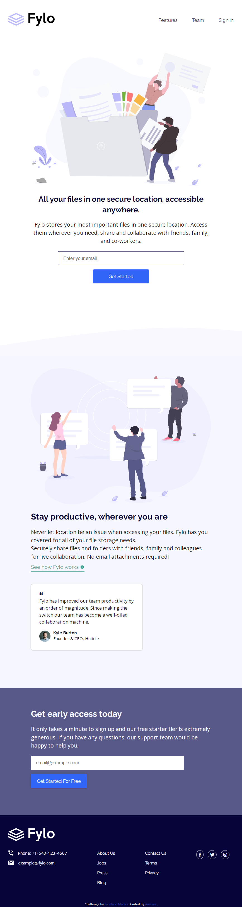
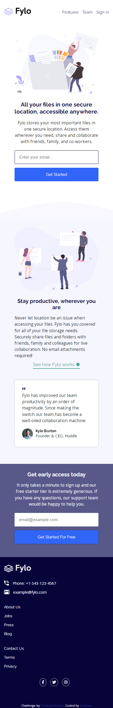

# Frontend Mentor - Fylo landing page with two column layout solution

This is a solution to the [Fylo landing page with two column layout challenge on Frontend Mentor](https://www.frontendmentor.io/challenges/fylo-landing-page-with-two-column-layout-5ca5ef041e82137ec91a50f5). Frontend Mentor challenges help you improve your coding skills by building realistic projects. 

## Table of contents

- [Overview](#overview)
  - [The challenge](#the-challenge)
  - [Screenshot](#screenshot)
  - [Links](#links)
- [My process](#my-process)
  - [Built with](#built-with)
  - [What I learned](#what-i-learned)
  - [Continued development](#continued-development)
  - [Useful resources](#useful-resources)
- [Author](#author)
- [Acknowledgments](#acknowledgments)

## Overview

### The challenge

Users should be able to:

- View the optimal layout for the site depending on their device's screen size
- See hover states for all interactive elements on the page

### Screenshot

### Links

- Solution URL: [Github Repository](https://github.com/Austinet/fylo-landing-page-two-column-layout.git)
- Live Site URL: [Hosted Site](https://Austinet.github.io/fylo-landing-page-two-column-layout/)

## My process

### Built with

- Semantic HTML5 markup
- CSS custom properties
- Flexbox
- Desktop-first workflow

### Continued development

Keep up the good work, keep practicing.

## Author

- Website - [Udhe Austine Ogaga](https://Austinet.github.io/portfolio/)
- LinkedIn - [Udhe Austine Ogaga](https://linkedin.com/in/udhe-austine-ogaga-25961820b)
- Frontend Mentor - [@Austinet](https://www.frontendmentor.io/profile/austinet)
- Twitter - [@austineudhe](https://www.twitter.com/austineudhe)

## Acknowledgments

Gratitute to God, Frontend mentor, Google, YouTube, and CTRL + Z.
